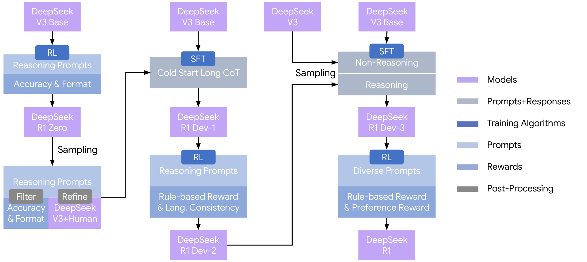
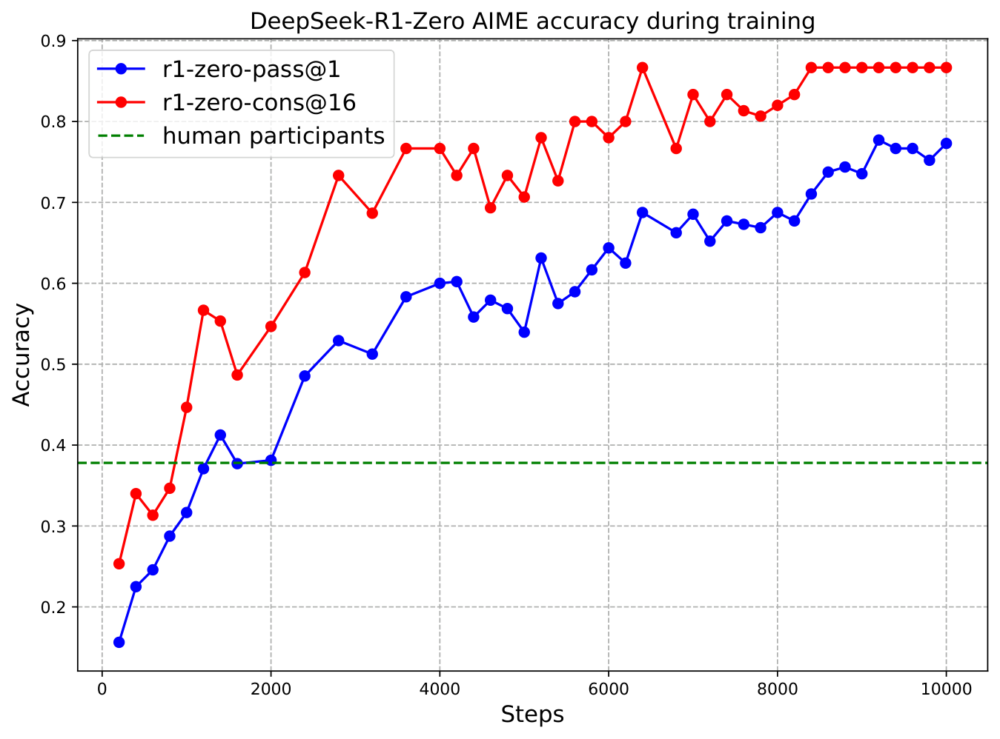
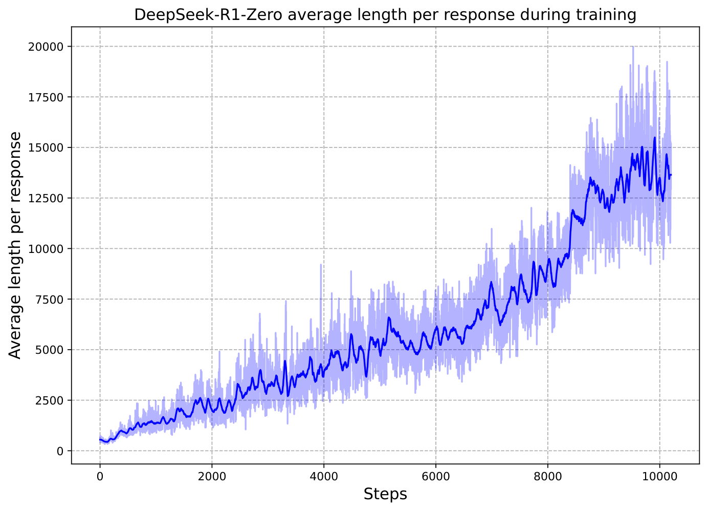

# 论文导读：DeepSeek-R1

## 一、论文信息

- **论文标题**：DeepSeek-R1: Incentivizing Reasoning Capability in LLMs via Reinforcement Learning
- **作者**：DeepSeek-AI
- **来源**：Nature, 2025
- **版本说明**：本文最初以 arXiv:2501.12948 公开，后发表于 Nature
- **导读整理工具**：Claude Code

论文链接：<https://www.nature.com/articles/s41586-025-09422-z>

---

## 二、研究背景

大语言模型已经在问答、写作、代码生成等任务上表现出很强的能力，但在更复杂的推理任务上，模型往往仍然依赖大量人工标注的推理轨迹。例如，许多已有方法会给模型提供“逐步思考”的示例，让模型模仿人类的推理过程。这种方法虽然有效，但也存在两个明显问题。

第一，人工标注推理过程的成本很高，难以扩展到更大规模的数据。第二，人类给出的推理轨迹本身带有局限性，模型学到的往往只是“模仿人类怎么想”，而不一定能探索出更有效、更适合机器自身的推理方式。

这篇论文关注的核心问题就是：**如果不给模型提供人工推理示范，而是只通过强化学习奖励正确答案，模型能不能自己发展出推理能力？**

作者围绕这个问题提出了 DeepSeek-R1-Zero 和 DeepSeek-R1 两个模型，重点探索强化学习在推理能力形成中的作用。

---

## 三、论文核心思路

论文的总体思路可以分成两层。

### 1. DeepSeek-R1-Zero：纯强化学习探索推理能力

DeepSeek-R1-Zero 直接在 DeepSeek-V3-Base 的基础上进行强化学习训练，不先进行传统的监督微调。训练过程中，模型只被要求输出统一格式：先给出思考过程，再给出最终答案。除此之外，作者尽量不对推理内容施加额外限制。

这种设计的目的是让模型在较少人为干预的前提下，自主探索出有效的推理方式。论文表明，在这种纯强化学习设置下，模型逐渐学会了更长的思考、更频繁的自我检查，以及尝试多种解题路径等行为。

### 2. DeepSeek-R1：在纯强化学习基础上加入对齐与可读性优化

虽然 DeepSeek-R1-Zero 在数学和代码任务上表现很强，但也有明显问题，例如：

- 可读性较差
- 推理内容中可能出现中英文混杂
- 在通用问答和写作场景中表现不够稳定

为了解决这些问题，作者进一步提出 DeepSeek-R1。它采用一个多阶段训练流程：先准备少量冷启动数据，再进行强化学习，然后做拒绝采样和监督微调，最后再进行一轮强化学习，把推理能力、可读性和人类偏好结合起来。这样得到的 DeepSeek-R1 不仅保留了较强的推理能力，也更适合真实对话场景。

---

## 四、关键方法解析

### 1. GRPO：论文采用的强化学习算法

论文中使用的强化学习算法叫 **GRPO（Group Relative Policy Optimization）**。它的基本思想是：对于同一个问题，模型一次生成一组候选答案，然后根据这一组答案的相对表现来计算优势值，再更新策略。

与常见的 PPO 相比，GRPO 的目标是简化训练流程，并减少强化学习阶段的资源消耗。对于大模型训练来说，这一点很重要，因为推理模型本身就需要消耗较多算力。

作者将 GRPO 同时用于 DeepSeek-R1-Zero 和 DeepSeek-R1 的训练，是整篇论文方法设计中的关键一环。

### 2. 奖励设计

在 DeepSeek-R1-Zero 中，奖励主要来自两部分：

- **准确性奖励**：最终答案是否正确
- **格式奖励**：输出是否符合要求的标签结构

例如在数学题中，如果答案可以被规则验证，那么模型只要最终答对，就会得到奖励。代码任务中也可以通过编译和测试用例来自动判断结果是否正确。这样就避免了人工逐步标注推理过程的高成本。

在 DeepSeek-R1 中，作者又额外加入了更复杂的奖励机制，例如：

- 对有帮助程度的奖励模型
- 对安全性的奖励模型
- 对语言一致性的奖励

这些奖励的加入，使模型不仅追求“答对”，还更关注“答得清楚”“答得安全”“答得更符合人类使用习惯”。

### 3. 多阶段训练流程

DeepSeek-R1 的一个重要贡献是提出了完整的多阶段训练管线。作者并没有停留在“纯强化学习已经有效”这个结论上，而是继续思考：怎样让这个模型真正变得更可用？

因此论文中的 DeepSeek-R1 流程大致是：

1. 基于少量冷启动数据建立更自然的推理表达方式
2. 进行第一阶段强化学习，提升推理和语言一致性
3. 通过拒绝采样和监督微调整合高质量数据
4. 再进行第二阶段强化学习，同时兼顾推理、帮助性和安全性

这一流程说明，论文并不是简单地说“只用 RL 就足够了”，而是先证明 RL 可以激发推理能力，再说明如何把这种能力整理成更实用的系统。

---

## 五、论文中的真实配图与说明

### 图 1：DeepSeek-R1 的多阶段训练流程

这张图对应论文中关于 DeepSeek-R1 的主流程图，展示了从基础模型到冷启动、强化学习、拒绝采样、监督微调、再到最终模型的完整路径。它非常适合作为全文的总览图，因为读者可以先从整体上理解 R1 并不是单一步骤训练出来的，而是经过多轮迭代优化。

### 图 2：DeepSeek-R1-Zero 在 AIME 上的准确率变化

这张图展示了 DeepSeek-R1-Zero 在强化学习训练过程中，AIME 数学竞赛成绩的提升轨迹。论文中提到，它的平均 Pass@1 从 **15.6%** 提升到了 **77.9%**，如果结合 self-consistency，准确率还能达到 **86.7%**。这张图非常直观地支持了论文的核心论点：即使没有人工推理轨迹，模型仍然可以在强化学习中逐步形成强推理能力。

### 图 3：DeepSeek-R1-Zero 的平均响应长度变化

这张图展示了训练过程中模型平均响应长度不断增加的趋势。作者把它解释为“thinking time”增加，即模型愿意花更多 token 去思考复杂问题。图 2 与图 3 放在一起看，非常能说明论文的一个关键现象：**随着强化学习推进，模型不仅答题正确率上升，而且推理过程本身也变长、更深入。**

---

## 六、实验结果分析

论文在多个维度上评估了模型表现，包括英语通用能力、代码能力、数学能力和中文任务能力。

### 1. 数学与推理能力提升明显

从论文给出的阶段性实验结果来看，DeepSeek-R1 在数学任务上表现很强：

- AIME 2024 Pass@1 达到 **79.8**
- MATH-500 Pass@1 达到 **97.3**
- 在多个推理类 benchmark 上都保持较高水平

这说明强化学习对于“可验证答案”的任务尤其有效，因为数学题天然适合做规则判断。

### 2. 代码能力也有明显提升

论文中代码方向的结果同样突出。例如：

- LiveCodeBench 提升到 **65.9**
- Codeforces Rating 达到 **2029**
- Aider-Polyglot 达到 **53.3**

这说明强化学习不仅适用于数学推理，也适用于可以客观验证正确性的代码任务。对于代码生成来说，测试用例和编译结果本身就能构成高质量奖励。

### 3. 最终模型兼顾推理能力与对齐能力

作者特别强调，DeepSeek-R1-Zero 虽然很强，但并不够“好用”；而 DeepSeek-R1 则在后续多阶段训练中显著改善了指令跟随和用户偏好指标。例如：

- AlpacaEval 2.0 达到 **87.6**
- ArenaHard 达到 **92.3**
- IF-Eval 达到 **83.3**

这说明论文的真正贡献不只是做出了一个会“深度思考”的模型，而是进一步把这种能力做成了一个更可读、更稳定、更适合使用的推理模型。

---

## 七、论文的意义与启发

我认为这篇论文最有价值的地方有三点。

### 1. 证明了推理能力可以被“激励出来”

这篇论文最核心的贡献，就是证明了大模型的推理能力不一定只能依赖人工示范，也可以通过强化学习在一定条件下自然形成。也就是说，模型不是单纯模仿人类写下来的步骤，而是在奖励驱动下逐步学会更有效的解题方式。

### 2. 强化学习对“可验证任务”尤其有效

论文反复强调数学、代码、逻辑推理这些任务，因为它们都具有比较明确的正确答案。只要奖励机制设计得好，模型就可以通过不断试错获得提升。因此，这篇论文也提示我们：强化学习最适合优先落地在那些“结果容易判定”的任务中。

### 3. 真实可用的模型仍然需要多阶段工程化设计

如果只看 DeepSeek-R1-Zero，很容易得出“纯 RL 已经够了”的结论。但论文实际上进一步证明：要做一个真正可用的模型，仅有高推理分数还不够，还要考虑语言一致性、可读性、帮助性和安全性。这一点体现出大模型研究和工程实践之间的结合。

---

## 八、存在的局限

论文最后也提到了模型的不足，我觉得这些局限很值得注意。

1. **结构化输出能力仍然有限**：相比一些专门优化过工具调用与结构输出的模型，DeepSeek-R1 在这方面还有差距。
2. **工具使用能力不足**：它不能像某些代理系统一样主动调用搜索、计算器等工具来增强回答。
3. **Token 效率还有优化空间**：虽然它会根据问题难度动态分配推理长度，但在简单问题上仍然可能出现“想太多”的情况。
4. **安全风险不能忽视**：推理能力增强后，模型也可能生成更具可执行性的危险内容，因此安全对齐必须同步加强。

这些问题说明，推理能力越强，不代表模型天然越安全、越高效，后续仍然需要继续迭代。

---

## 九、个人总结

通过阅读这篇论文，我最大的感受是：**强化学习并不是只是“调一调模型”，而是有可能真正改变模型形成推理能力的方式。**

在过去的印象里，大模型推理似乎主要依赖更大的参数量、更多的数据，以及更复杂的提示词。但这篇论文提醒我们，后训练阶段的优化同样非常关键。只要奖励信号足够明确，模型就可能在没有人工详细示范的情况下，自主发展出反思、验证、重试等推理行为。

另外，我也觉得论文在研究思路上很完整。作者并没有只停留在“DeepSeek-R1-Zero 很强”这个结论上，而是继续往前推进，解决可读性、语言混杂和对齐问题，最终形成更实用的 DeepSeek-R1。这种从“能力出现”到“工程可用”的路线，对实际系统开发很有参考价值。

总的来说，这篇论文让我更加理解了当前推理模型的发展方向：未来模型的竞争，可能不仅是谁参数更大、谁数据更多，还包括谁更善于通过后训练和强化学习，把潜在能力真正激发出来。

---

## 十、参考链接

- Nature 期刊页面：<https://www.nature.com/articles/s41586-025-09422-z>
- arXiv 摘要页：<https://arxiv.org/abs/2501.12948>
- 论文 PDF：<https://arxiv.org/pdf/2501.12948>
